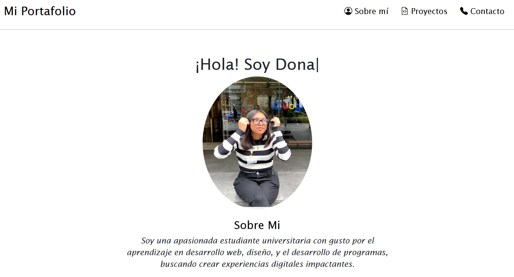
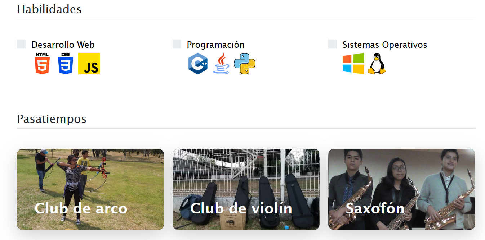
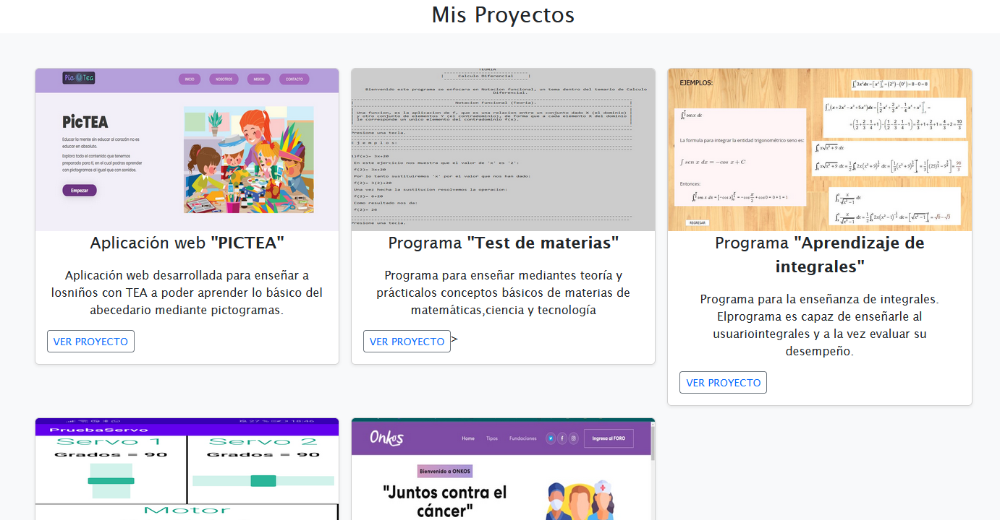
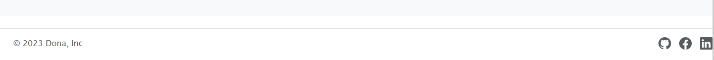

# Portafolio personal responsivo con BOOTSTRAP 5

💻 El presente proyecto fue creado para el bootcamp de TECNOLOCHICAS PRO 

💻 El propósito del sitio web es mostrar la experiencia de la desarolladora mediante 
la muestra de sus proyectos realizados.

 <a href="https://astounding-lily-ebe01c.netlify.app/" class="Sitioweb"> 👉 Visítalo ya 👈</a>

Incluye las siguientes secciones:

* SOBRE MI 

* PROYECTOS

* CONTACTO

## Tecnologías utilizadas

## 📭 Contacto 📭

Si estás interesad@ en compartir o conectar para algún proyecto u oportunidad laboral, contáctame.

<a href="www.linkedin.com/in/moncayo-garcía-donayi-azucena-9564b3276"></img></a>

© 2023 Dona (Programa Tecnolochicas PRO)